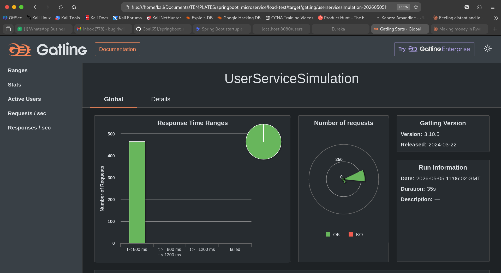
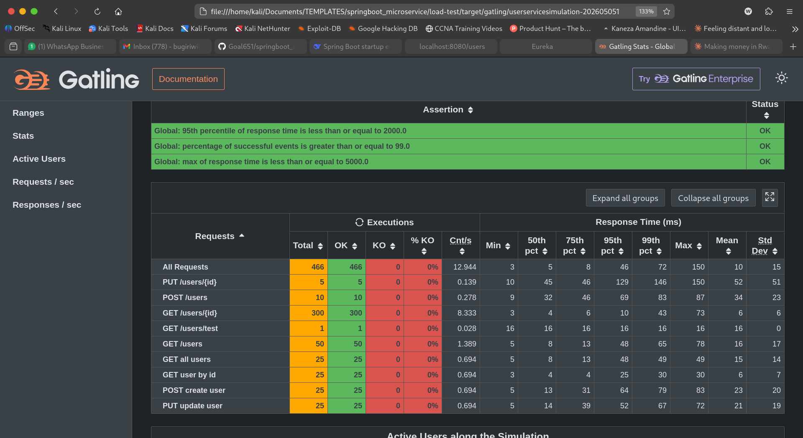
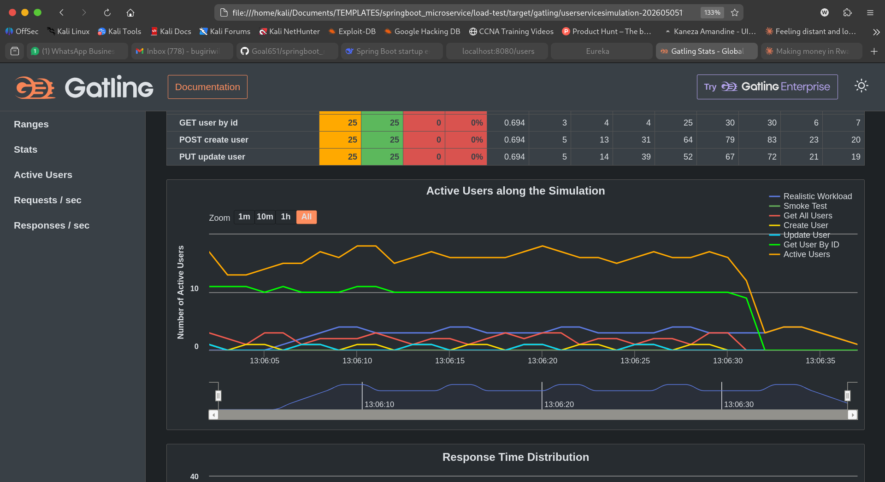

# Spring Boot Microservices Template


A production-ready Spring Boot 3 microservices template. Includes service discovery, centralized configuration, API gateway with JWT filtering, Redis caching, Kafka event streaming, circuit breaking, and full Docker orchestration with proper health checks. Built to be cloned, understood, and extended.

---

## Table of Contents

- [Architecture](#architecture)
- [Services](#services)
- [Technology Stack](#technology-stack)
- [Core Workflows](#core-workflows)
- [Quick Start](#quick-start)
- [Performance](#performance)
- [Configuration](#configuration)
- [Kafka Topics](#kafka-topics)
- [Redis Caching](#redis-caching)
- [Health Checks](#health-checks)
- [Centralized Logging](#centralized-logging)
- [Adding a New Service](#adding-a-new-service)
- [Kubernetes](#kubernetes)
- [Common Issues](#common-issues)
- [Port Reference](#port-reference)

---

## Architecture

```
                          +-----------------------+
                          |      Client Apps      |
                          +-----------+-----------+
                                      |
                                      v
                          +-----------+-----------+
                          |      API Gateway      |
                          |   JWT Filter  :8080   |
                          +-----------+-----------+
                                      |
               +-----------+----------+-----------+-----------+
               |           |                      |           |
               v           v                      v           v
        +------+----+ +----+------+        +------+----+ +----+------+
        |   Auth    | |   User    |        |   Mail    | |   Notif.  |
        |  Service  | |  Service  |        |  Service  | |  Service  |
        |   :8083   | |   :8081   |        |   :8084   | |   :8082   |
        +------+----+ +----+------+        +------+----+ +----+------+
               |           |                      |           |
               |      +----+----+                 |           |
               |      |  Redis  |                 |           |
               |      |  :6379  |                 |           |
               |      +---------+                 |           |
               |           |                      |           |
               |      +----+----+                 |           |
               +----->|         |<----------------+-----------+
                      | Kafka   |
                      | :29092  |
                      |         |
                      +----+----+
                           |
               +-----------+-----------+
               |                       |
               v                       v
    +----------+----------+  +---------+---------+
    |      PostgreSQL     |  |     Zookeeper     |
    |        :5432        |  |       :2181       |
    +---------------------+  +-------------------+

    +-----------------------+  +----------------------+
    |    Eureka Server      |  |    Config Server     |
    |        :8761          |  |        :8888         |
    +-----------------------+  +----------------------+

    All services register with Eureka on startup.
    All services fetch config from Config Server on startup.
```

---

## Services

| Service | Port | Role |
| :--- | :---: | :--- |
| API Gateway | 8080 | Single entry point. JWT validation, request routing, load balancing |
| Eureka Server | 8761 | Service registry. All services register and discover each other here |
| Config Server | 8888 | Centralized configuration. Serves per-service properties at startup |
| User Service | 8081 | User management. PostgreSQL + Redis cache + Kafka producer |
| Auth Service | 8083 | Authentication. JWT issuance and validation |
| Mail Service | 8084 | Email delivery. Kafka consumer — sends emails on events |
| Notification Service | 8082 | Event processing. Kafka consumer for user lifecycle events |
| PostgreSQL | 2500 | Primary relational database |
| Redis | 6379 | Distributed cache for user lookups and session data |
| Kafka | 19092 | Event streaming between services |
| Zookeeper | 2181 | Kafka cluster coordination |

---

## Technology Stack

| Category | Technology |
| :--- | :--- |
| Core | Java 21, Spring Boot 3.5.7, Spring Cloud 2025.0.0 |
| Gateway | Spring Cloud Gateway |
| Discovery | Netflix Eureka |
| Configuration | Spring Cloud Config Server |
| Database | PostgreSQL 15, Spring Data JPA, Hibernate |
| Caching | Redis 7.x, Spring Cache, JSON serialization |
| Messaging | Apache Kafka 7.5.0, Spring Kafka |
| Security | Spring Security, JWT (jjwt 0.12.5) |
| Resilience | Resilience4j Circuit Breaker, Spring Retry |
| Monitoring | Spring Boot Actuator, Loki, Promtail, Grafana |
| Load Testing | Gatling 3.10.5 |
| Containerization | Docker, Docker Compose |
| Orchestration | Kubernetes (Deployments, StatefulSets, HPA) |

---

## Core Workflows

### Request Lifecycle

```
  Client                Gateway              Service             Database
    |                      |                    |                    |
    |  HTTP Request        |                    |                    |
    |--------------------->|                    |                    |
    |                      |                    |                    |
    |                      | Validate JWT       |                    |
    |                      |----+               |                    |
    |                      |    |               |                    |
    |                      |<---+               |                    |
    |                      |                    |                    |
    |                      | Route via lb://    |                    |
    |                      |------------------->|                    |
    |                      |                    |                    |
    |                      |                    | Query / Write      |
    |                      |                    |------------------->|
    |                      |                    |                    |
    |                      |                    | Result             |
    |                      |                    |<-------------------|
    |                      |                    |                    |
    |                      | Response           |                    |
    |                      |<-------------------|                    |
    |                      |                    |                    |
    | HTTP Response        |                    |                    |
    |<---------------------|                    |                    |
```

### Redis Cache Flow

```
  Service                 Redis                PostgreSQL
    |                       |                      |
    | GET user::{id}        |                      |
    |---------------------->|                      |
    |                       |                      |
    |        [Cache Hit]    |                      |
    |<----------------------|                      |
    |   Return cached user  |                      |
    |                       |                      |
    |        [Cache Miss]   |                      |
    |<----------------------|                      |
    |                       |                      |
    | SELECT * FROM users   |                      |
    |---------------------------------------------->|
    |                       |                      |
    | User result           |                      |
    |<----------------------------------------------|
    |                       |                      |
    | SET user::{id} TTL    |                      |
    |---------------------->|                      |
    |                       |                      |
    | Return user           |                      |
    |<---                   |                      |
```

### Kafka Event Flow

```
  User Service            Kafka Broker           Mail Service        SMTP Server
       |                       |                      |                   |
       | Publish USER_CREATED  |                      |                   |
       |---------------------->|                      |                   |
       |                       |                      |                   |
       |                       | Consume EVENT        |                   |
       |                       |--------------------->|                   |
       |                       |                      |                   |
       |                       |                      | Send Email        |
       |                       |                      |------------------>|
       |                       |                      |                   |
       |                       |                      | 250 OK            |
       |                       |                      |<------------------|
```

### Authentication Flow

```
  Client            Gateway           Auth Service        User Service
    |                  |                   |                   |
    | POST /auth/login |                   |                   |
    |----------------->|                   |                   |
    |                  | Forward           |                   |
    |                  |------------------>|                   |
    |                  |                   | Fetch user        |
    |                  |                   |------------------>|
    |                  |                   |                   |
    |                  |                   | User details      |
    |                  |                   |<------------------|
    |                  |                   |                   |
    |                  |                   | Validate password |
    |                  |                   |----+              |
    |                  |                   |    |              |
    |                  |                   |<---+              |
    |                  |                   |                   |
    |                  | JWT Token         |                   |
    |                  |<------------------|                   |
    |                  |                   |                   |
    | 200 OK + JWT     |                   |                   |
    |<-----------------|                   |                   |
```

---

## Quick Start

**Prerequisites:** Docker, Docker Compose

```bash
# Clone
git clone https://github.com/Goal651/springboot_microservice
cd springboot_microservice

# Setup environment
cp .env.example .env
# Edit .env with your values

# Start all services
docker compose -f compose.dev.yml up --build
```

Services take approximately 3-4 minutes to fully start. Check status:

```bash
# All containers and health status
docker compose -f compose.dev.yml ps

# Follow logs
docker compose -f compose.dev.yml logs -f

# Test gateway
curl http://localhost:8080/actuator/health

# Eureka dashboard
open http://localhost:8761
```

---

## Performance

Load tested with [Gatling](https://gatling.io) — 50 concurrent users, 30 second ramp,
6 concurrent scenarios running simultaneously against the full stack through the API gateway.

| Metric | Result |
| :--- | :--- |
| Total Requests | 466 |
| Success Rate | 100% |
| Mean Response Time | 10ms |
| 50th Percentile | 5ms |
| 95th Percentile | 46ms |
| 99th Percentile | 72ms |
| Max Response Time | 150ms |
| Throughput | 12.9 req/sec |

`GET /users/{id}` achieved **6ms p95** — Redis cache serving repeated lookups without hitting PostgreSQL.





Run load tests yourself:

```bash
cd load-tests
mvn gatling:test -DbaseUrl=http://localhost:8080 -Djwt=YOUR_JWT_TOKEN

# Higher load
mvn gatling:test -DbaseUrl=http://localhost:8080 -Djwt=YOUR_JWT_TOKEN -Dusers=200 -Dramp=60
```

---

## Configuration

All service configuration is managed centrally by Config Server.

```
configServer/src/main/resources/
├── application.properties          <- Config Server own config
└── configs/
    ├── application.properties      <- Shared by ALL services
    ├── user-service.properties
    ├── auth-service.properties
    ├── mail-service.properties
    ├── gateway.properties
    └── eureka.properties
```

Each microservice's own `application.properties` contains only two lines:

```properties
spring.application.name=user-service
spring.config.import=optional:configserver:http://config-server:8888
```

Everything else — ports, DB URLs, Kafka addresses, Redis config — lives in the Config Server. Secrets are passed via `.env` into Docker Compose environment variables, then referenced as `${VAR_NAME}` inside config files.

To refresh config at runtime without restarting:

```bash
curl -X POST http://localhost:8081/actuator/refresh
```

---

## Kafka Topics

| Topic | Producer | Consumers | Events |
| :--- | :--- | :--- | :--- |
| `user-events` | user-service | notification-service | USER_CREATED, USER_UPDATED, USER_DELETED |
| `auth-events` | auth-service | mail-service | USER_REGISTERED, PASSWORD_RESET |
| `mail-events` | any service | mail-service | EMAIL_REQUESTED |

Internal broker (Docker): `kafka:29092`
External broker (host machine): `localhost:19092`

---

## Redis Caching

Cache keys follow the pattern `entity::{id}`. TTL is configured per entity type in `configs/user-service.properties`.

```properties
spring.data.redis.host=redis
spring.data.redis.port=6379
spring.cache.type=redis
spring.cache.redis.time-to-live=600000
```

Check Redis directly:

```bash
docker exec -it redis redis-cli
> KEYS *
> GET user::1
> TTL user::1
```

---

## Health Checks

All services implement Docker health checks. Startup order is enforced via `condition: service_healthy`.

| Service | Health Check |
| :--- | :--- |
| Spring services | `GET /actuator/health` |
| PostgreSQL | `pg_isready` |
| Kafka | `kafka-broker-api-versions --bootstrap-server localhost:29092` |
| Zookeeper | `echo srvr \| nc localhost 2181 \| grep Mode: standalone` |
| Redis | `redis-cli ping` |

Startup order: `zookeeper` → `kafka` → `db` → `eureka` → `config-server` → `services`

---

## Centralized Logging

Logs are centralized with **Promtail → Loki → Grafana**.

- **Promtail** tails Docker container logs and forwards them to Loki.
- **Loki** stores and indexes logs.
- **Grafana** provides querying and visualization.

Start the stack (logging services are already included in compose):

```bash
docker compose -f compose.dev.yml up --build -d
```

Access:

- Grafana: `http://localhost:3000`
- Loki: `http://localhost:3100`

Default Grafana credentials are `admin/admin` (override in `.env` with `GRAFANA_ADMIN_USER` and `GRAFANA_ADMIN_PASSWORD`).

Example LogQL queries in Grafana Explore:

```logql
{compose_service="gateway"}
```

```logql
{compose_project="springboot_microservice"}
```

---

## Adding a New Service

**1. Create Spring Boot project** with dependencies: `web`, `actuator`, `eureka-client`, `spring-cloud-config`

**2. Set `application.properties`** to two lines only:

```properties
spring.application.name=your-service
spring.config.import=optional:configserver:http://config-server:8888
```

**3. Add config file** at `configServer/src/main/resources/configs/your-service.properties`:

```properties
server.port=8085
eureka.client.service-url.defaultZone=http://eureka:8761/eureka
```

**4. Add route** to `configs/gateway.properties`:

```properties
spring.cloud.gateway.routes[N].id=your-service
spring.cloud.gateway.routes[N].uri=lb://your-service
spring.cloud.gateway.routes[N].predicates[0]=Path=/your-path/**
```

**5. Add to `compose.dev.yml`**:

```yaml
your-service:
  build:
    context: ./yourService
    dockerfile: Dockerfile.dev
  container_name: your-service
  depends_on:
    eureka:
      condition: service_healthy
    config-server:
      condition: service_healthy
  healthcheck:
    test: ["CMD-SHELL", "curl -f http://localhost:8085/actuator/health || exit 1"]
    interval: 10s
    timeout: 5s
    retries: 5
    start_period: 40s
  networks:
    - micro-net
  ports:
    - "8085:8085"
```

---

## Kubernetes

Full Kubernetes manifests are available in the `k8s/` directory.

```bash
# Create namespace
kubectl apply -f k8s/namespace.yaml

# Apply secrets and config
kubectl apply -f k8s/app-secrets.yaml
kubectl apply -f k8s/app-config.yaml

# Deploy infrastructure
kubectl apply -f k8s/infrastructure/ --recursive

# Deploy services
kubectl apply -f k8s/config-server/
kubectl apply -f k8s/eureka/
kubectl apply -f k8s/gateway/
kubectl apply -f k8s/user-service/
kubectl apply -f k8s/auth-service/
kubectl apply -f k8s/mail-service/
```

Each service has: `Deployment`, `Service`, `HorizontalPodAutoscaler`, and `ConfigMap`. Infrastructure (PostgreSQL, Redis, Kafka, Zookeeper) uses `StatefulSet` for stable network identity and persistent storage.

---

## Common Issues

**Service can't reach Kafka**
Use `kafka:29092` inside Docker network. Use `localhost:19092` from host machine. Never use port `9092` directly.

**Service can't reach database**
Use `db:5432` inside Docker network. Use `localhost:2500` from host machine.

**Config Server not found on startup**
Eureka must be healthy before Config Server starts. Config Server must be healthy before any service that imports from it. Check `depends_on` conditions in `compose.dev.yml`.

**Service starts but stays unhealthy**
Check if `spring-boot-starter-web` is in `pom.xml`. Without it, Spring Boot runs in non-web mode and Actuator has no HTTP server to bind to.

**Kafka deserialization errors**
Ensure producer and consumer DTOs match. Disable type headers:

```properties
spring.kafka.producer.properties.spring.json.add.type.headers=false
spring.kafka.consumer.properties.spring.json.use.type.headers=false
```

**Port mapping confusion**
Kafka container listens on `29092` internally. Host port `19092` maps to container port `29092`. Compose mapping is `"19092:29092"`.

---

## Port Reference

| Service | Host Port | Container Port |
| :--- | :---: | :---: |
| API Gateway | 8080 | 8080 |
| User Service | 8081 | 8081 |
| Notification Service | 8082 | 8082 |
| Auth Service | 8083 | 8083 |
| Mail Service | 8084 | 8084 |
| Eureka Server | 8761 | 8761 |
| Config Server | 8888 | 8888 |
| PostgreSQL | 2500 | 5432 |
| Redis | 6379 | 6379 |
| Kafka | 19092 | 29092 |
| Zookeeper | 2181 | 2181 |
| Grafana | 3000 | 3000 |
| Loki | 3100 | 3100 |

---

Built by [Ponnada V V Naga Shanmukha](https://github.com/ShanmukhaPonnada) 